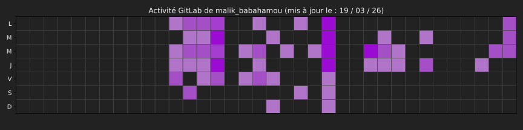

# 👋 Salut, moi c’est [Ton Nom]

Bienvenue sur mon profil GitHub ! Ici, vous trouverez mes projets, contributions et un peu de ma personnalité.

---

## 🛠 À propos de moi

- Étudiant / Développeur / Passionné de [ton domaine]  
- Langages : Python, Java, JavaScript, [etc.]  
- J’aime : Ski, escalade, résoudre des problèmes logiques 🧩  

---

## 📊 Statistiques

> *Remplace `TON_USERNAME` par ton nom GitHub pour afficher tes stats réelles.*

---

## 🚀 Projets récents

| Nom du projet | Description | Lien |
|---------------|------------|------|
| Projet 1      | Courte description | [GitHub](https://github.com/malik-dev-com/projet1) |
| Projet 2      | Courte description | [GitHub](https://github.com/malik-dev-com/projet2) |
| Projet 3      | Courte description | [GitHub](https://github.com/malik-dev-com/projet3) |

---

## 📅 Activité

Ici tu peux mettre ton heatmap GitLab/GitHub ou un graphique des contributions. Exemple :

---

## 📫 Contact

- Email : ton.email@example.com  
- LinkedIn : [Ton profil](https://linkedin.com/in/tonprofil)  
- Portfolio : [tonsite.com](https://tonsite.com)

---

*✨ Merci de visiter mon profil !*
